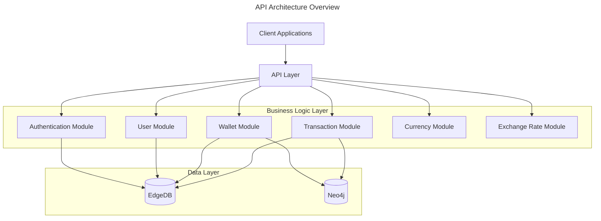
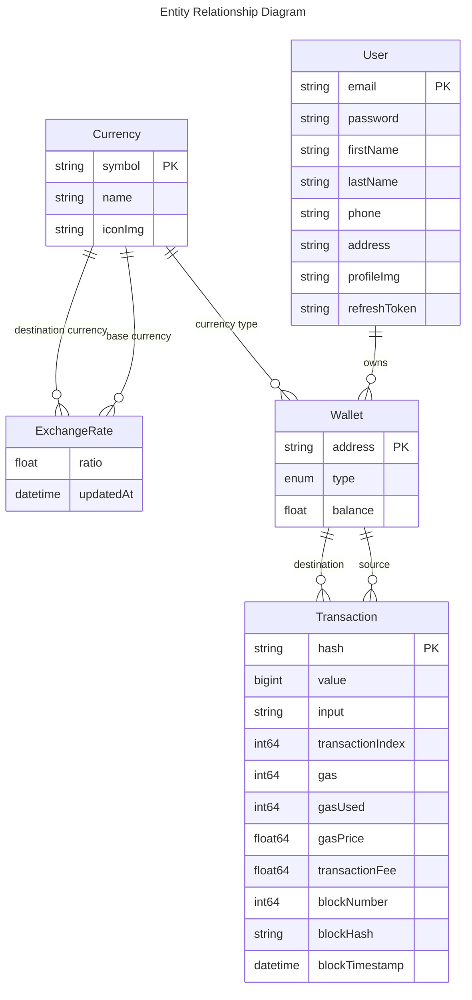

# API Documentation for COS30049 Blockchain-based Cryptocurrency Exchange

## Technical Summary

This API provides a comprehensive backend for a blockchain-based cryptocurrency exchange platform. It enables users to manage wallets, view transactions, authenticate, and interact with cryptocurrency data. The system is built on a modern architecture using NestJS and EdgeDB, with additional graph database capabilities through Neo4j for complex relationship queries.

## Technology Table

| Technology | Description                                                         |
| :--------- | :------------------------------------------------------------------ |
| NestJS     | Progressive Node.js framework for building server-side applications |
| EdgeDB     | Next-generation graph-relational database                           |
| Neo4j      | Graph database for complex relationship queries                     |
| JWT        | JSON Web Tokens for secure authentication                           |
| Swagger    | API documentation and testing                                       |
| TypeScript | Typed JavaScript for better developer experience                    |
| Zod        | Schema validation library                                           |
| Pino       | Logging library                                                     |

## Architecture Diagram



## Data Models

### Entity Relationship Diagram



## API Endpoints

### Authentication

| Endpoint        | Method | Description                              |
| :-------------- | :----- | :--------------------------------------- |
| `/auth/login`   | POST   | Authenticate user and receive JWT tokens |
| `/auth/refresh` | GET    | Refresh access token using refresh token |

### Users

| Endpoint | Method | Description               |
| :------- | :----- | :------------------------ |
| `/users` | POST   | Create a new user account |

### Wallets

| Endpoint                         | Method | Description                                                  |
| :------------------------------- | :----- | :----------------------------------------------------------- |
| `/wallets`                       | GET    | Get all wallets with optional filtering                      |
| `/wallets/:address`              | GET    | Get wallet details by address                                |
| `/wallets/:address/details`      | GET    | Get detailed wallet information                              |
| `/wallets/:address/transactions` | GET    | Get transactions for a specific wallet                       |
| `/wallets/:address/neighbors`    | GET    | Get wallets that have transactions with the specified wallet |

### Transactions

| Endpoint              | Method | Description                                  |
| :-------------------- | :----- | :------------------------------------------- |
| `/transactions/graph` | GET    | Get transaction graph data for visualization |

## Request and Response Examples

### Authentication

#### Login

**Request:**

```http
POST /auth/login
Content-Type: application/json

{
  "email": "user@example.com",
  "password": "securePassword123"
}
```

**Response:**

```json
{
  "accessToken": "eyJhbGciOiJIUzI1NiIsInR5cCI6IkpXVCJ9...",
  "refreshToken": "eyJhbGciOiJIUzI1NiIsInR5cCI6IkpXVCJ9..."
}
```

### Users

#### Create User

**Request:**

```http
POST /users
Content-Type: application/json

{
  "email": "newuser@example.com",
  "password": "securePassword123",
  "firstName": "John",
  "lastName": "Doe"
}
```

**Response:**

```json
{
  "id": "123e4567-e89b-12d3-a456-426614174000",
  "email": "newuser@example.com",
  "firstName": "John",
  "lastName": "Doe",
  "fullName": "John Doe"
}
```

### Wallets

#### Get Wallet Details

**Request:**

```http
GET /wallets/0x742d35Cc6634C0532925a3b844Bc454e4438f44e/details
```

**Response:**

```json
{
  "address": "0x742d35Cc6634C0532925a3b844Bc454e4438f44e",
  "type": "EOA",
  "balance": 1.25,
  "currency": {
    "symbol": "ETH",
    "name": "Ethereum",
    "iconImg": "https://example.com/eth-icon.png"
  },
  "transactionCount": 42,
  "incomingTransactionCount": 15,
  "outgoingTransactionCount": 27
}
```

#### Get Wallet Transactions

**Request:**

```http
GET /wallets/0x742d35Cc6634C0532925a3b844Bc454e4438f44e/transactions?type=INCOMING
```

**Response:**

```json
{
  "transactions": [
    {
      "hash": "0x1234567890abcdef1234567890abcdef1234567890abcdef1234567890abcdef",
      "value": "1000000000000000000",
      "sourceWallet": {
        "address": "0x111122223333444455556666777788889999aaaa"
      },
      "destinationWallet": {
        "address": "0x742d35Cc6634C0532925a3b844Bc454e4438f44e"
      },
      "blockTimestamp": "2023-01-15T12:30:45Z",
      "transactionFee": 0.002
    }
    // More transactions...
  ],
  "total": 15
}
```

## Error Handling

The API uses standard HTTP status codes to indicate the success or failure of requests:

| Status Code | Description                                                                   |
| :---------- | :---------------------------------------------------------------------------- |
| 200         | OK - The request was successful                                               |
| 201         | Created - A new resource was successfully created                             |
| 400         | Bad Request - The request was invalid or cannot be served                     |
| 401         | Unauthorized - Authentication is required and has failed or not been provided |
| 403         | Forbidden - The server understood the request but refuses to authorize it     |
| 404         | Not Found - The requested resource could not be found                         |
| 500         | Internal Server Error - An error occurred on the server                       |

Error responses follow this format:

```json
{
  "statusCode": 400,
  "message": "Validation failed",
  "error": "Bad Request",
  "details": [
    {
      "field": "email",
      "message": "Invalid email format"
    }
  ]
}
```

## Authentication

The API uses JWT (JSON Web Tokens) for authentication. To access protected endpoints:

1. Obtain an access token by logging in via `/auth/login`
2. Include the token in the Authorization header of subsequent requests:
   ```
   Authorization: Bearer <your_access_token>
   ```
3. When the access token expires, use the refresh token at `/auth/refresh` to obtain a new access token

> 🚨 **Warning:** Never share your JWT tokens or store them in insecure locations.

## Rate Limiting

To ensure service stability, the API implements rate limiting:

- 100 requests per minute for authenticated users
- 20 requests per minute for unauthenticated users

> ℹ️ **Note:** Rate limit information is included in response headers:
>
> - `X-RateLimit-Limit`: Maximum requests allowed in the time window
> - `X-RateLimit-Remaining`: Remaining requests in the current window
> - `X-RateLimit-Reset`: Time when the rate limit window resets (Unix timestamp)

## Versioning

The API uses URL versioning. The current version is v1, which is included in the base URL:

```
/api/v1/
```

## Getting Started

To start using the API:

1. Register a user account via `/users`
2. Authenticate via `/auth/login`
3. Use the returned JWT token in the Authorization header for subsequent requests
4. Explore wallet and transaction data using the provided endpoints

## Development and Testing

The API includes Swagger documentation accessible at `/api/docs` when running in development mode.
