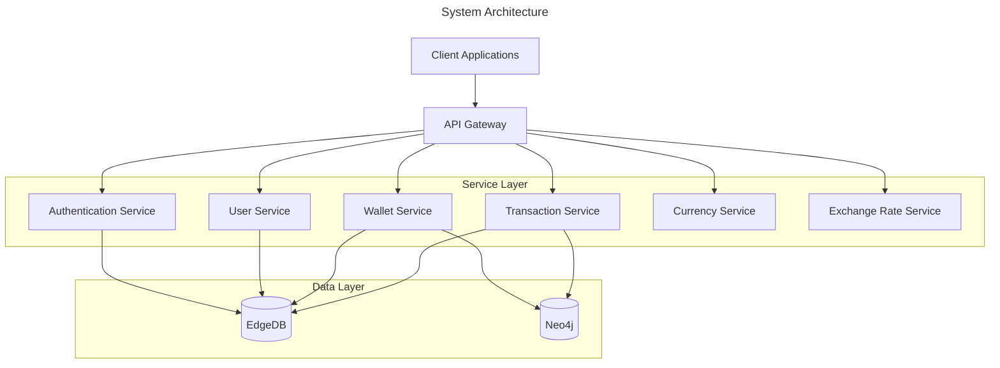
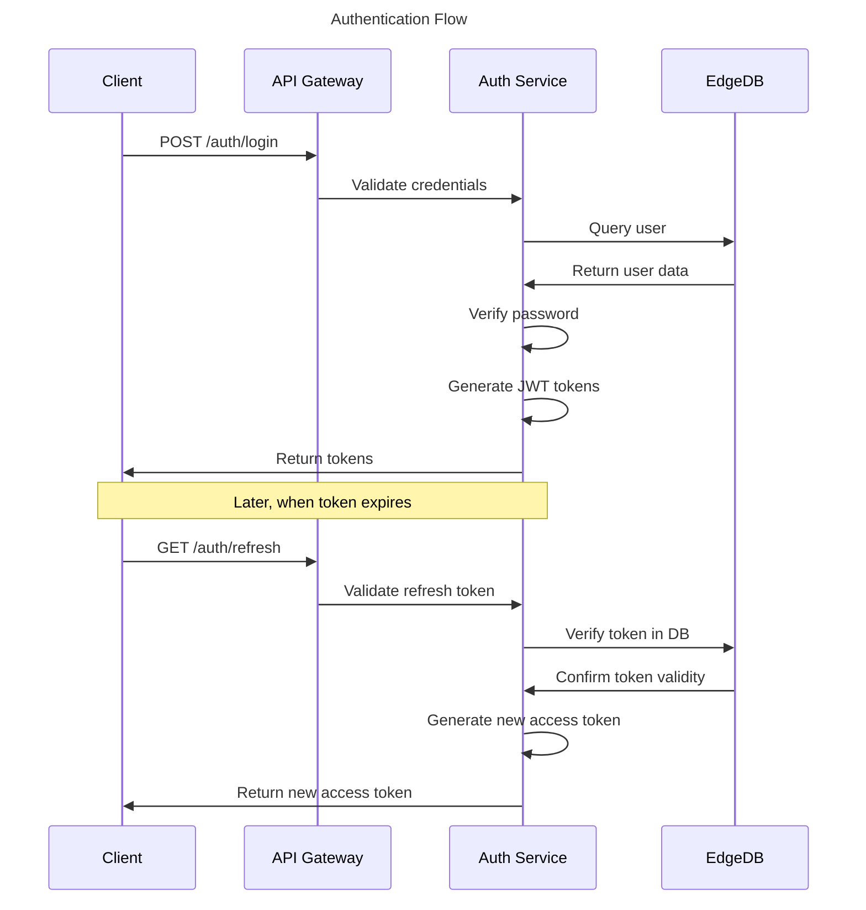
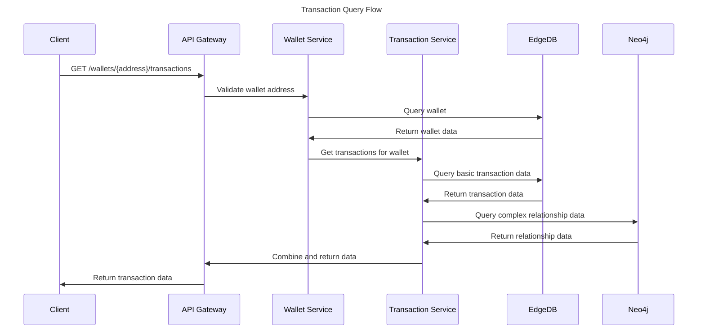

# Architecture for COS30049 Blockchain-based Cryptocurrency Exchange

## Technical Summary

This architecture defines a scalable, maintainable backend for a blockchain-based cryptocurrency exchange platform. The system employs a modular architecture using NestJS to ensure high maintainability, scalability, and testability while supporting cryptocurrency wallet management, transaction tracking, and user authentication.

## Technology Table

| Technology | Description                                                         |
| :--------- | :------------------------------------------------------------------ |
| NestJS     | Progressive Node.js framework for building server-side applications |
| EdgeDB     | Next-generation graph-relational database for data storage          |
| Neo4j      | Graph database for complex relationship queries                     |
| TypeScript | Typed JavaScript for better developer experience                    |
| JWT        | JSON Web Tokens for secure authentication                           |
| Swagger    | API documentation and testing                                       |
| Zod        | Schema validation library                                           |
| Pino       | Logging library                                                     |
| Docker     | Containerization for consistent deployment                          |

## Architectural Diagrams

### System Architecture



### Authentication Flow



### Transaction Query Flow



## Project Structure

```
/
├── /src
│   ├── /main.ts                # Application entry point
│   ├── /common                 # Shared utilities and middleware
│   │   ├── /decorators         # Custom decorators
│   │   ├── /filters            # Exception filters
│   │   ├── /guards             # Authorization guards
│   │   ├── /interceptors       # Response transformers
│   │   ├── /logger             # Logging configuration
│   │   └── /seeder             # Database seeders
│   ├── /modules                # Feature modules
│   │   ├── /app.module.ts      # Root module
│   │   ├── /auth               # Authentication
│   │   ├── /user               # User management
│   │   ├── /wallet             # Wallet operations
│   │   ├── /transaction        # Transaction handling
│   │   ├── /currency           # Currency information
│   │   ├── /exchange-rate      # Exchange rate data
│   │   ├── /edgedb             # EdgeDB connection
│   │   └── /neo4j              # Neo4j connection
│   └── /scripts                # Utility scripts
├── /dbschema                   # EdgeDB schema definitions
│   ├── /default.esdl           # Main schema file
│   ├── /migrations             # Database migrations
│   └── /edgeql-js              # Generated EdgeDB queries
├── /dist                       # Compiled output
├── /node_modules               # Dependencies
├── /docs                       # Documentation
├── .env                        # Environment variables
├── package.json                # Project metadata and scripts
├── tsconfig.json               # TypeScript configuration
└── README.md                   # Project overview
```

## Key Design Decisions

### 1. Dual Database Approach

**Decision**: Use both EdgeDB and Neo4j for different aspects of data storage and querying.

**Rationale**:

- EdgeDB provides strong typing and schema validation for structured data
- Neo4j excels at relationship queries needed for transaction graph analysis
- This combination offers the best of both worlds for cryptocurrency data

### 2. Modular Architecture

**Decision**: Organize code into feature modules following NestJS best practices.

**Rationale**:

- Improves maintainability by separating concerns
- Enables independent development of features
- Facilitates testing and code reuse

### 3. JWT Authentication

**Decision**: Use JWT tokens with refresh token rotation for authentication.

**Rationale**:

- Stateless authentication reduces database load
- Refresh tokens enable longer sessions without compromising security
- Industry standard approach for API authentication

### 4. API Documentation with Swagger

**Decision**: Automatically generate API documentation using Swagger.

**Rationale**:

- Keeps documentation in sync with code
- Provides interactive testing interface
- Improves developer experience

## Performance Considerations

1. **Database Indexing**: Critical fields like wallet addresses and transaction hashes are indexed for fast lookups.

2. **Caching Strategy**: Frequently accessed data like exchange rates can be cached to reduce database load.

3. **Pagination**: All list endpoints support pagination to handle large datasets efficiently.

4. **Query Optimization**: Complex graph queries are optimized to minimize processing time.

## Security Measures

1. **Authentication**: JWT-based authentication with proper token expiration.

2. **Password Handling**: Passwords are hashed using bcrypt before storage.

3. **Input Validation**: All inputs are validated using Zod schemas.

4. **Rate Limiting**: API endpoints are protected against abuse with rate limiting.

5. **CORS Configuration**: Cross-Origin Resource Sharing is properly configured.

## Deployment Strategy

The application is designed to be deployed in a containerized environment using Docker, with separate containers for:

1. NestJS API
2. EdgeDB database
3. Neo4j database

This enables easy scaling of individual components as needed.
