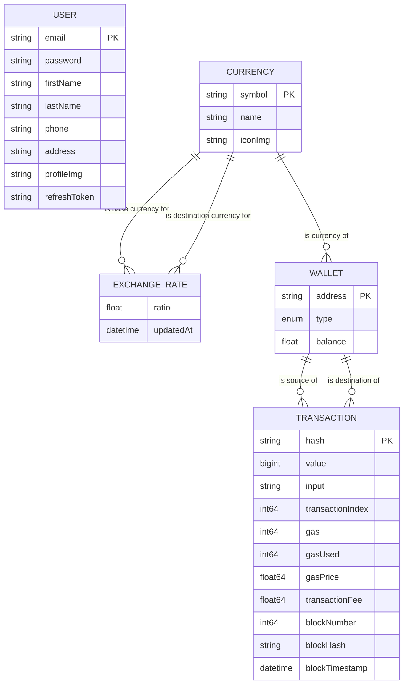

# Crypto Exchange Platform Data Models

## Overview

This document describes the core data models for the cryptocurrency exchange platform. The system manages users, cryptocurrencies, wallets, transactions, and exchange rates between different cryptocurrencies.

## Entity Relationship Diagram



## Data Models

### Model: User

| Field           | Type   | Required | Description                      | Constraints    |
| --------------- | ------ | -------- | -------------------------------- | -------------- |
| email           | String | Yes      | User email address               | Unique         |
| normalizedEmail | String | No       | Normalized version of email      | Unique         |
| password        | String | Yes      | Hashed password                  |                |
| firstName       | String | No       | User's first name                |                |
| lastName        | String | No       | User's last name                 |                |
| fullName        | String | No       | Computed full name               | Computed field |
| phone           | String | No       | User's phone number              |                |
| address         | String | No       | User's physical address          |                |
| profileImg      | String | No       | URL to profile image             |                |
| refreshToken    | String | No       | Token for authentication refresh |                |

### Model: Currency

| Field   | Type   | Required | Description                 | Constraints |
| ------- | ------ | -------- | --------------------------- | ----------- |
| symbol  | String | Yes      | Currency symbol (e.g., ETH) | Unique      |
| name    | String | Yes      | Full name (e.g., Ethereum)  | Unique      |
| iconImg | String | Yes      | URL to currency icon image  |             |

### Model: ExchangeRate

| Field               | Type     | Required | Description                       | Constraints |
| ------------------- | -------- | -------- | --------------------------------- | ----------- |
| ratio               | Float64  | Yes      | Exchange ratio between currencies |             |
| baseCurrency        | Currency | Yes      | Source currency                   | Foreign Key |
| destinationCurrency | Currency | Yes      | Target currency                   | Foreign Key |
| updatedAt           | DateTime | Yes      | Last update timestamp             |             |

### Model: Wallet

| Field    | Type       | Required | Description            | Constraints  |
| -------- | ---------- | -------- | ---------------------- | ------------ |
| address  | String     | Yes      | Wallet address         | Unique       |
| type     | WalletType | Yes      | EOA or Contract        | Enum         |
| balance  | Float64    | Yes      | Current balance        | Default: 0.0 |
| currency | Currency   | Yes      | Currency of the wallet | Foreign Key  |

### Model: Transaction

| Field             | Type     | Required | Description            | Constraints |
| ----------------- | -------- | -------- | ---------------------- | ----------- |
| hash              | String   | Yes      | Transaction hash       | Unique      |
| value             | BigInt   | Yes      | Transaction amount     |             |
| sourceWallet      | Wallet   | Yes      | Source wallet          | Foreign Key |
| destinationWallet | Wallet   | Yes      | Destination wallet     | Foreign Key |
| input             | String   | Yes      | Transaction input data |             |
| transactionIndex  | Int64    | Yes      | Index in the block     |             |
| gas               | Int64    | Yes      | Gas limit              |             |
| gasUsed           | Int64    | Yes      | Gas used               |             |
| gasPrice          | Float64  | Yes      | Gas price              |             |
| transactionFee    | Float64  | Yes      | Total transaction fee  |             |
| blockNumber       | Int64    | Yes      | Block number           |             |
| blockHash         | String   | Yes      | Block hash             |             |
| blockTimestamp    | DateTime | Yes      | Block timestamp        |             |

## Relationships

| Relationship                  | Type        | Description                                          |
| ----------------------------- | ----------- | ---------------------------------------------------- |
| Currency → ExchangeRate       | One-to-Many | A currency can be the base for many exchange rates   |
| Currency → ExchangeRate       | One-to-Many | A currency can be the destination for many rates     |
| Currency → Wallet             | One-to-Many | A currency can have many wallets                     |
| Wallet → Transaction (source) | One-to-Many | A wallet can be the source of many transactions      |
| Wallet → Transaction (dest)   | One-to-Many | A wallet can be the destination of many transactions |

## Indexes

| Model       | Fields  | Type   | Description                     |
| ----------- | ------- | ------ | ------------------------------- |
| User        | email   | Unique | Fast lookup by email            |
| Currency    | symbol  | Unique | Fast lookup by currency symbol  |
| Currency    | name    | Unique | Fast lookup by currency name    |
| Wallet      | address | Unique | Fast lookup by wallet address   |
| Transaction | hash    | Unique | Fast lookup by transaction hash |

## Constraints and Validations

| Model       | Field           | Validation | Description                     |
| ----------- | --------------- | ---------- | ------------------------------- |
| User        | email           | Exclusive  | Email must be unique            |
| User        | normalizedEmail | Exclusive  | Normalized email must be unique |
| Currency    | symbol          | Exclusive  | Currency symbol must be unique  |
| Currency    | name            | Exclusive  | Currency name must be unique    |
| Wallet      | address         | Exclusive  | Wallet address must be unique   |
| Wallet      | type            | Enum       | Must be either EOA or Contract  |
| Transaction | hash            | Exclusive  | Transaction hash must be unique |

## Example Usage

```typescript
// Get a user by email
const user = await e.select(e.User, (user) => ({
  filter_single: { email: 'user@example.com' },
}));

// Get all wallets for a specific currency
const ethWallets = await e.select(e.Wallet, (wallet) => ({
  filter: e.op(wallet.currency.symbol, '=', 'ETH'),
}));

// Get exchange rate between two currencies
const ethToBtcRate = await e.select(e.ExchangeRate, (rate) => ({
  filter_single: {
    baseCurrency: { symbol: 'ETH' },
    destinationCurrency: { symbol: 'BTC' },
  },
}));

// Get all transactions from a specific wallet
const transactions = await e.select(e.Transaction, (tx) => ({
  filter: e.op(tx.sourceWallet.address, '=', '0x123...'),
}));
```

## Notes and Considerations

- The system uses EdgeDB as the primary database
- Wallet balances are stored as float64 which may not be ideal for financial calculations - consider using a fixed-point representation or string-based storage for production
- Transaction values are stored as bigint to handle large cryptocurrency amounts
- The system currently doesn't have explicit user-wallet ownership relationships - consider adding this if needed
- Exchange rates should be regularly updated from external sources
