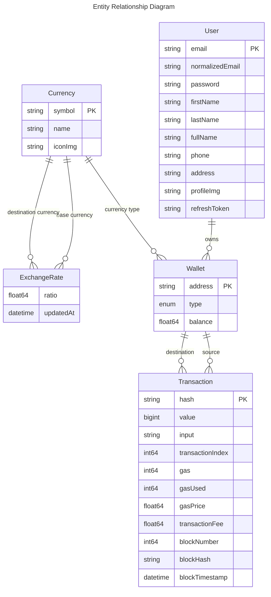

# User and Cryptocurrency Data Models

## Overview

Core data models for user management, cryptocurrency wallets, transactions, and exchange rates in the COS30049 Blockchain-based Cryptocurrency Exchange platform.

## Entity Relationship Diagram



## Data Models

### Model: User

| Field           | Type   | Required | Description                                   | Constraints                        |
| :-------------- | :----- | :------- | :-------------------------------------------- | :--------------------------------- |
| email           | string | Yes      | User email address                            | Primary Key, Unique                |
| normalizedEmail | string | No       | Normalized email for case-insensitive lookups | Unique                             |
| password        | string | Yes      | Hashed password                               |                                    |
| firstName       | string | No       | User's first name                             |                                    |
| lastName        | string | No       | User's last name                              |                                    |
| fullName        | string | No       | Computed full name                            | Computed from firstName + lastName |
| phone           | string | No       | User's phone number                           |                                    |
| address         | string | No       | User's physical address                       |                                    |
| profileImg      | string | No       | URL to user's profile image                   |                                    |
| refreshToken    | string | No       | JWT refresh token                             |                                    |

### Model: Currency

| Field   | Type   | Required | Description                 | Constraints         |
| :------ | :----- | :------- | :-------------------------- | :------------------ |
| symbol  | string | Yes      | Currency symbol (e.g., ETH) | Primary Key, Unique |
| name    | string | Yes      | Full name (e.g., Ethereum)  | Unique              |
| iconImg | string | Yes      | URL to currency icon image  |                     |

### Model: ExchangeRate

| Field               | Type     | Required | Description                       | Constraints |
| :------------------ | :------- | :------- | :-------------------------------- | :---------- |
| ratio               | float64  | Yes      | Exchange rate ratio               |             |
| baseCurrency        | Currency | Yes      | Reference to base currency        | Foreign Key |
| destinationCurrency | Currency | Yes      | Reference to destination currency | Foreign Key |
| updatedAt           | datetime | Yes      | Last update timestamp             |             |

### Model: Wallet

| Field    | Type     | Required | Description                   | Constraints         |
| :------- | :------- | :------- | :---------------------------- | :------------------ |
| address  | string   | Yes      | Wallet address                | Primary Key, Unique |
| type     | enum     | Yes      | Wallet type (EOA or Contract) |                     |
| balance  | float64  | Yes      | Current balance               | Default: 0.0        |
| currency | Currency | Yes      | Reference to currency         | Foreign Key         |

### Model: Transaction

| Field             | Type     | Required | Description                     | Constraints         |
| :---------------- | :------- | :------- | :------------------------------ | :------------------ |
| hash              | string   | Yes      | Transaction hash                | Primary Key, Unique |
| value             | bigint   | Yes      | Transaction amount              |                     |
| sourceWallet      | Wallet   | Yes      | Reference to source wallet      | Foreign Key         |
| destinationWallet | Wallet   | Yes      | Reference to destination wallet | Foreign Key         |
| input             | string   | Yes      | Transaction input data          |                     |
| transactionIndex  | int64    | Yes      | Index in the block              |                     |
| gas               | int64    | Yes      | Gas limit                       |                     |
| gasUsed           | int64    | Yes      | Gas used                        |                     |
| gasPrice          | float64  | Yes      | Gas price                       |                     |
| transactionFee    | float64  | Yes      | Total transaction fee           |                     |
| blockNumber       | int64    | Yes      | Block number                    |                     |
| blockHash         | string   | Yes      | Block hash                      |                     |
| blockTimestamp    | datetime | Yes      | Block timestamp                 |                     |

## Relationships

| Relationship                          | Type        | Description                                                  |
| :------------------------------------ | :---------- | :----------------------------------------------------------- |
| User → Wallet                         | One-to-Many | A user can own multiple wallets                              |
| Currency → Wallet                     | One-to-Many | A currency can be used by multiple wallets                   |
| Currency → ExchangeRate (base)        | One-to-Many | A currency can be the base in multiple exchange rates        |
| Currency → ExchangeRate (destination) | One-to-Many | A currency can be the destination in multiple exchange rates |
| Wallet → Transaction (source)         | One-to-Many | A wallet can be the source of multiple transactions          |
| Wallet → Transaction (destination)    | One-to-Many | A wallet can be the destination of multiple transactions     |

## Indexes

| Model       | Fields          | Type   | Description                     |
| :---------- | :-------------- | :----- | :------------------------------ |
| User        | email           | Unique | Fast lookup by email            |
| User        | normalizedEmail | Unique | Case-insensitive email lookup   |
| Currency    | symbol          | Unique | Fast lookup by symbol           |
| Currency    | name            | Unique | Fast lookup by name             |
| Wallet      | address         | Unique | Fast lookup by wallet address   |
| Transaction | hash            | Unique | Fast lookup by transaction hash |

## Constraints and Validations

| Model       | Constraint            | Description                                |
| :---------- | :-------------------- | :----------------------------------------- |
| User        | Email format          | Email must be in valid format              |
| User        | Password complexity   | Password must meet complexity requirements |
| Currency    | Symbol format         | Symbol must be uppercase letters           |
| Wallet      | Address format        | Address must be valid blockchain address   |
| Transaction | Positive value        | Transaction value must be positive         |
| Transaction | Source != Destination | Source and destination wallets must differ |

## Example Usage

### Creating a User

```typescript
const user = await e.insert(e.User, {
  email: 'user@example.com',
  normalizedEmail: 'user@example.com'.toLowerCase(),
  password: await bcrypt.hash('securePassword123', 10),
  firstName: 'John',
  lastName: 'Doe',
  phone: '+1234567890',
  address: '123 Main St, City, Country',
});
```

### Creating a Wallet

```typescript
const currency = await e.select(e.Currency, (c) => ({
  filter: e.op(c.symbol, '=', 'ETH'),
}));

const wallet = await e.insert(e.Wallet, {
  address: '0x742d35Cc6634C0532925a3b844Bc454e4438f44e',
  type: 'EOA',
  balance: 1.25,
  currency: currency,
});
```

### Querying Transactions

```typescript
const transactions = await e.select(e.Transaction, (t) => ({
  filter: e.op(
    t.sourceWallet.address,
    '=',
    '0x742d35Cc6634C0532925a3b844Bc454e4438f44e',
  ),
  order_by: {
    expression: t.blockTimestamp,
    direction: e.DESC,
  },
  limit: 10,
}));
```
